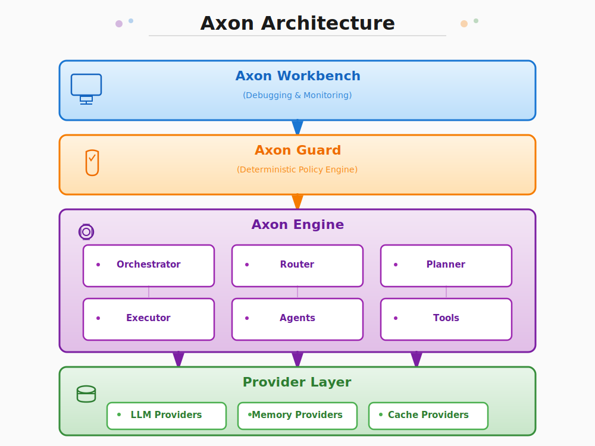

# Axon Engine

<div align="center">

**Multi-Agent SDK — Pluggable, Self-Evolving, Builder-Control, and Enterprise-Grade Secure**

[](https://www.python.org/downloads/)
[](LICENSE)
[](https://python-poetry.org/)
[](https://github.com/psf/black)
[](https://mypy.readthedocs.io/)

*Beyond workflows, towards autonomy. Beyond features, towards intelligence.*

[Quick Start](#quick-start) • [Documentation](#documentation) • [Examples](#examples) • [Architecture](#architecture) • [Contributing](#contributing)

</div>

---

## Table of Contents

- [Overview](#overview)
- [Key Features](#key-features)
- [Installation](#installation)
- [Quick Start](#quick-start)
- [Core Concepts](#core-concepts)
- [Advanced Usage](#advanced-usage)
- [Examples](#examples)
- [Architecture](#architecture)
- [Development](#development)
- [Documentation](#documentation)
- [Contributing](#contributing)
- [License](#license)

## Overview

# **Axon : Multi-Agent SDK — Pluggable, Self-Evolving, Builder-Control, and Financial-Grade Secure**


## **Key Features**


### **Pluggable**


Migration cost is zero, fully user-friendly
- Axon can be freely integrated with any framework, such as LangChain, Coze, Dify, or n8n, and other frameworks can also be seamlessly connected to Axon. This ensures zero development overhead and eliminates migration costs
- All components are fully plug-and-play, such as LLM providers (GPT, Claude, Gemini, Grok), memory components, and planning executors.


### **Perfect Multi-Agent Context Engineering**

Solve problems such as context contamination, state fragmentation, uncontrollable behavior, and misunderstandings.
- Equipped with a comprehensive agent-to-agent information transmission protocol framework, the protocol allows for customized information content and type, while ensuring accuracy and consistency.
- In situations where context is confused or missing, agents intelligently communicate and find the correct context.
- Agents align on goals and share a state board containing the current state information of the overall goal, ensuring consistent state.

### **Memory**

Solve the problems of loop freezing, memory drift and redundancy, and chaotic retrieval
1. Memory functions include: memory compression (active and passive), memory hierarchical management
2. Memory system support: short-term, mid term, and long-term memory, situational and semantic memory, adaptive strategies to achieve almost infinite context

### **AI-Native**

Agents freely orchestrate task implementation paths, unlike traditional workflows.
- The agent includes a comprehensive toolkit, including tools, web search browsers, file operations, terminal functionality, and agent-as-a-tool.
- Through Axon Nexus, intelligent agents collaborate using standard protocols and self-organize into a market-based ecosystem.
- The agent system is scalable, enabling evolution from a local prototype to a distributed intelligent society.

### **Evolvable**

Axon gets smarter with use.
- At the agent level, the system accumulates knowledge and continuously optimizes its strategies through feedback on goals and outcomes.
- At the framework level, Axon automatically generates execution traces and annotated data for SFT and RL training. An integrated evaluation suite defines and measures metrics, creating a closed loop between execution and model evolution.

### **Security**

- Runs in a sandbox environment to ensure agent behavior is secure.
- Axon employs a two-layer security mechanism to ensure verifiable and compliant agent behavior.
- A deterministic policy engine works in conjunction with a probabilistic guidance layer to prevent out-of-bounds or unsafe operations.

### **Builder-Control**

Built-in version control gives developers full control over the entire process.
- Version control ensures full traceability and rollback of all functional nodes.
- Builder controllability: Agent decisions and all behaviors are fully controllable and visualized, with the system generating execution traces, logs, and policy evaluations.

### **Structured Output (Format)**

Guarantees **consistent, structured outputs** across any LLM provider — even those that don’t natively support it.

- Validate responses against **Pydantic-style schemas**, automatically repairing malformed outputs until they match spec.

## Installation

### Prerequisites
- Python 3.12 or higher
- Poetry (recommended) or pip

### Install from PyPI (Coming Soon)
```bash
pip install axon-engine
```

### Install from Source
```bash
# Clone the repository
git clone https://github.com/nxcode/axon-engine.git
cd axon-engine

# Install with Poetry (recommended)
poetry install

# Or install with pip
pip install -e .
```

### Environment Setup
```bash
# Required: Set your LLM provider API key
export OPENAI_API_KEY="your-openai-api-key"

# Optional: Configure other providers
export ANTHROPIC_API_KEY="your-anthropic-api-key"
export REDIS_URL="redis://localhost:6379"
```

## Quick Start

### 30-Second Demo

Create a powerful AI agent with just a few lines of code:

```python
import asyncio
from axon import Agent, tool

@tool
async def get_weather(city: str) -> str:
    """Get current weather for a city."""
    # Your weather API integration here
    return f"Sunny, 22°C in {city}"

@tool
async def calculate(expression: str) -> float:
    """Safely evaluate mathematical expressions."""
    # Your calculation logic here
    return eval(expression.replace('^', '**'))

async def main():
    # Create agent with tools - uses sensible defaults
    agent = Agent(
        name="assistant",
        role_prompt="You are a helpful assistant with weather and math capabilities.",
        tools=[get_weather, calculate]
    )

    # Use the agent
    result = await agent.run("What's the weather in Tokyo and calculate 15 * 23?")
    print(result.output)

# Run the demo
asyncio.run(main())
```

### 5-Minute Advanced Example

Build a multi-agent system with intelligent orchestration:

```python
import asyncio
from axon import (
    Agent, Orchestrator, DefaultPlannerAgent, Router,
    TaskClassifier, ProviderRegistry, RoutingRule, TaskCategory, tool
)

# Define specialized tools
@tool
async def analyze_data(data: str) -> dict:
    """Analyze business data and extract insights."""
    return {"insights": ["trend_up", "seasonal_pattern"], "confidence": 0.87}

@tool
async def generate_code(requirements: str) -> str:
    """Generate Python code based on requirements."""
    return """
import matplotlib.pyplot as plt
import pandas as pd

# Your generated visualization code here
plt.figure(figsize=(10, 6))
plt.plot([1, 2, 3, 4], [10, 23, 45, 30])
plt.title('Business Metrics Trend')
plt.show()
"""

@tool
async def write_report(data: dict, code: str) -> str:
    """Write an executive summary report."""
    return f"""
# Executive Summary

## Key Insights
- {data.get('insights', [])}
- Confidence Level: {data.get('confidence', 0) * 100}%

## Technical Implementation
The analysis was implemented using:
{code[:100]}...

## Recommendations
Based on the data trends, we recommend...
"""

async def main():
    # Set up intelligent LLM routing for cost optimization
    registry = ProviderRegistry()
    # registry.register_provider("fast_llm", fast_provider)
    # registry.register_provider("creative_llm", creative_provider)
    # registry.register_provider("code_llm", code_specialist_provider)

    classifier = TaskClassifier()  # Uses default LLM for classification

    routing_rules = [
        RoutingRule(TaskCategory.CODE_GENERATION, "code_llm", priority=3),
        RoutingRule(TaskCategory.CREATIVE_WRITING, "creative_llm", priority=3),
        RoutingRule(TaskCategory.DATA_ANALYSIS, "fast_llm", priority=2),
    ]

    router = Router(classifier, registry, routing_rules)

    # Create specialized agents
    data_analyst = Agent(
        name="data_analyst",
        role_prompt="You are a data analysis expert.",
        tools=[analyze_data]
    )

    code_generator = Agent(
        name="code_generator",
        role_prompt="You are a Python code generation specialist.",
        tools=[generate_code]
    )

    report_writer = Agent(
        name="report_writer",
        role_prompt="You are an executive report writer.",
        tools=[write_report]
    )

    # Set up orchestrator with cognitive planning
    orchestrator = Orchestrator(
        planner=DefaultPlannerAgent(),
        router=router,
        enable_cognitive_mode=True,  # Enables self-planning and adaptation
        enable_routing=True          # Enables intelligent LLM selection
    )

    # Register agents
    orchestrator.register_agent("data_analyst", data_analyst)
    orchestrator.register_agent("code_generator", code_generator)
    orchestrator.register_agent("report_writer", report_writer)

    # Execute complex multi-step goal
    result = await orchestrator.execute_goal(
        """Analyze the Q3 sales data, generate Python visualization code,
        and create an executive summary report with insights and recommendations."""
    )

    print(f"Goal achieved: {result.success}")
    print(f"Execution time: {result.execution_duration:.2f}s")
    print(f"Planning time: {result.planning_duration:.2f}s")

    # Access the complete execution trace
    if result.state:
        print(f"\nExecution steps: {len(result.state.history)}")
        for step in result.state.history[-3:]:  # Show last 3 steps
            print(f"- {step.step_type}: {step.component_name}")

asyncio.run(main())
```

## Core Concepts

### Agents
Agents are autonomous entities with defined roles, capabilities (tools), and reasoning capacity:

```python
from axon import Agent, AgentExecutionMode

agent = Agent(
    name="researcher",
    role_prompt="You are a research specialist focused on accuracy and citations.",
    tools=[search_web, summarize_text, fact_check],
    execution_mode=AgentExecutionMode.REACT,  # Reasoning + Acting loop
    termination_strategy=TerminationStrategy(max_iterations=10),
    enable_caching=True,
    temperature=0.7
)
```

### Tools
Convert any Python function into an agent capability with the `@tool` decorator:

```python
from axon import tool
from typing import List

@tool
async def search_database(query: str, table: str = "users") -> List[dict]:
    """Search database records matching the query."""
    # Your database logic here
    return [{"id": 1, "name": "John", "email": "john@example.com"}]

@tool
def validate_email(email: str) -> bool:
    """Validate email address format."""
    import re
    pattern = r'^[a-zA-Z0-9._%+-]+@[a-zA-Z0-9.-]+\.[a-zA-Z]{2,}$'
    return bool(re.match(pattern, email))
```

### State Management
Centralized state tracking with execution history and artifacts:

```python
from axon import State

# State is automatically managed by agents and orchestrators
state = State(overall_goal="Process customer onboarding")

# Access execution history
for step in state.history:
    print(f"{step.timestamp}: {step.component_name} - {step.success}")

# Store and retrieve data
state.set_data("customer_info", {"name": "Alice", "tier": "premium"})
customer = state.get_data("customer_info")

# Track artifacts (files, reports, etc.)
state.add_artifact("report.pdf", "/tmp/generated_report.pdf")
```

### Orchestration & Planning
Automate complex multi-step workflows with intelligent planning:

```python
from axon import Orchestrator, DefaultPlannerAgent

# Create planner with domain expertise
planner = DefaultPlannerAgent(
    role_prompt="You are an expert at planning software development workflows.",
    available_agents={
        "coder": "Writes and tests Python code",
        "reviewer": "Reviews code for quality and security",
        "deployer": "Deploys applications to production"
    }
)

orchestrator = Orchestrator(
    planner=planner,
    enable_cognitive_mode=True,  # Self-adapting execution
    max_iterations=20
)

# Let the system plan and execute automatically
result = await orchestrator.execute_goal(
    "Build a REST API for user management with authentication, testing, and deployment"
)
```

## Advanced Usage

### Custom Providers

Implement your own LLM, memory, or cache providers:

```python
from axon import BaseLLMProvider, BaseMemoryProvider, BaseCacheProvider

class CustomLLMProvider(BaseLLMProvider):
    async def generate(self, messages: List[dict], **kwargs) -> dict:
        # Your custom LLM implementation
        return {"content": "Generated response", "usage": {"tokens": 150}}

class VectorMemoryProvider(BaseMemoryProvider):
    async def store(self, session_id: str, data: dict) -> None:
        # Store in vector database
        pass

    async def retrieve(self, session_id: str, limit: int = 10) -> List[dict]:
        # Retrieve relevant memories
        return []

# Use custom providers
agent = Agent(
    name="custom_agent",
    llm_provider=CustomLLMProvider(),
    memory_provider=VectorMemoryProvider(),
    tools=[your_tools]
)
```

### Learning & Evolution

Enable continuous improvement with learning providers:

```python
from axon import (
    ReinforcementLearningProvider, BayesianOptimizationProvider,
    PerformanceTracker, ExecutionFeedback, MetricType
)

# Set up performance tracking
tracker = PerformanceTracker()
learning_provider = ReinforcementLearningProvider(
    action_space_size=10,
    learning_rate=0.01
)

# Create learning-enabled agent
agent = Agent(
    name="learning_agent",
    role_prompt="You are a customer service agent that improves over time.",
    tools=[handle_complaint, escalate_issue, send_followup],
    learning_provider=learning_provider,
    performance_tracker=tracker
)

# Provide feedback after each interaction
feedback = ExecutionFeedback(
    success=True,
    metrics={MetricType.RESPONSE_TIME: 2.3, MetricType.USER_SATISFACTION: 4.5},
    context={"customer_tier": "premium", "issue_type": "billing"}
)

await agent.learn_from_feedback(feedback)
```

### Advanced Caching

Configure multi-layer caching with Redis:

```python
from axon import MemoryCache, CacheConfig
from axon.providers.redis_cache import RedisCacheProvider

# Configure cache layers and TTLs
cache_config = CacheConfig(
    kv_cache_enabled=True,
    kv_cache_ttl=3600,            # Conversation history TTL (simulated KV cache)
    kv_cache_max_messages=200,    # Max messages to retain per conversation
    result_cache_enabled=True,
    result_cache_ttl=1800,        # General result cache TTL
    agent_cache_enabled=True,
    agent_cache_ttl=900,          # Agent result cache TTL
    tool_cache_enabled=True,
    tool_cache_ttl=1800           # Tool result cache TTL
)

# Redis backend
redis_provider = RedisCacheProvider(
    host="localhost",
    port=6379,
    db=0,
    key_prefix="axon:"
)

# MemoryCache orchestrates conversation + result caches
cache = MemoryCache(cache_provider=redis_provider, config=cache_config)

# Use with an agent
agent = Agent(
    name="cached_agent",
    tools=[expensive_computation],
    cache=cache,
    enable_caching=True
)
```

## Examples

The `examples/` directory contains comprehensive demonstrations:

- **[quick_start_demo.py](examples/quick_start_demo.py)**: Basic agent with tools and memory
- **[seo_blog_generator.py](examples/seo_blog_generator.py)**: Multi-agent content creation workflow
- **[trend_driven_cognitive_blog.py](examples/trend_driven_cognitive_blog.py)**: Advanced cognitive orchestration with real-time data
- **[quality_driven_cognitive_example.py](examples/quality_driven_cognitive_example.py)**: Quality assurance and iterative improvement

Run any example:
```bash
cd examples
python quick_start_demo.py
```

## Architecture

Axon follows a modular, pluggable architecture based on the [Axon Protocol](docs/Protocol.md):

<div align="center">



</div>

### Key Architectural Principles

1. **Pluggable-First**: Every component uses standardized interfaces
2. **Centralized State**: Single source of truth via the "Blackboard" pattern
3. **Asynchronous**: Built for high-performance concurrent operations
4. **Observable**: Comprehensive logging and metrics for debugging
5. **Secure**: Dual-layer safety with guidance and guardrails

## Development

### Setup Development Environment

```bash
# Clone repository
git clone https://github.com/nxcode/axon-engine.git
cd axon-engine

# Install with development dependencies
poetry install

# Install pre-commit hooks
poetry run pre-commit install
```

### Quality Assurance

```bash
# Run tests
poetry run pytest

# Check coverage
poetry run pytest --cov=axon --cov-report=html

# Format code
poetry run black axon/ tests/ examples/

# Lint code
poetry run ruff axon/ tests/ examples/

# Type checking
poetry run mypy axon/

# Security scanning
poetry run bandit -r axon/

# Run all quality checks
poetry run pre-commit run --all-files
```

### Testing

```bash
# Run all tests
poetry run pytest

# Run specific test categories
poetry run pytest -m unit          # Unit tests only
poetry run pytest -m integration   # Integration tests only
poetry run pytest -m "not slow"    # Skip slow tests

# Run with coverage
poetry run pytest --cov=axon --cov-report=term-missing

# Run performance benchmarks
poetry run pytest --benchmark-only
```

## Documentation

### Core Documentation
- **[Protocol](docs/Protocol.md)**: Founding principles and architecture manifesto
- **[Getting Started](docs/getting-started.md)**: Comprehensive setup and first steps
- **[Core Concepts](docs/core-concepts.md)**: Deep dive into agents, tools, and state
- **[API Reference](docs/api-reference.md)**: Complete API documentation

### Advanced Topics
- **[Agents](docs/agents.md)**: Agent types, execution modes, and best practices
- **[Tools](docs/tools.md)**: Creating and managing agent capabilities
- **[Providers](docs/providers.md)**: LLM, memory, and cache provider system
- **[Router](docs/router.md)**: Intelligent LLM provider routing strategies
- **[Caching](docs/caching.md)**: Performance optimization through caching

### Specialized Features
- **[Axon Guard](docs/axon_guard.md)**: Deterministic policy enforcement engine
- **[Proving Ground](docs/axon_proving_ground.md)**: Testing and validation framework
- **[Prompt as Code](docs/prompt_as_code.md)**: Version-controlled prompt management
- **[Memory System](docs/memory.md)**: Advanced memory and learning capabilities

## Contributing

We welcome contributions from the community! Axon is built on the principles of the [Axon Protocol](docs/Protocol.md) and maintains high standards for code quality.

### Contribution Guidelines

1. **Fork** the repository and create a feature branch
2. **Follow** the code style: Black formatting, Ruff linting, MyPy type checking
3. **Write** comprehensive tests for new features (minimum 80% coverage)
4. **Document** all public APIs with Google-style docstrings
5. **Commit** using [Conventional Commits](https://www.conventionalcommits.org/) format
6. **Submit** a Pull Request with issue linking and detailed description

### Development Workflow

```bash
# Create feature branch
git checkout -b feature/your-amazing-feature

# Make changes and test
poetry run pytest
poetry run black .
poetry run ruff .
poetry run mypy axon/

# Commit with conventional format
git commit -m "feat: add amazing new capability for agent coordination"

# Push and create PR
git push origin feature/your-amazing-feature
```

See [CONTRIBUTING.md](CONTRIBUTING.md) for detailed guidelines.

## Community & Support

- **GitHub Issues**: [Report bugs and request features](https://github.com/nxcode-io/axon/issues)
- **Discussions**: [Community discussions and Q&A](https://github.com/nxcode-io/axon/discussions)
- **Documentation**: [Comprehensive guides and API reference](docs/)

## License

This project is licensed under the MIT License - see the [LICENSE](LICENSE) file for details.

## Acknowledgments

Axon Engine is part of the **nxcode Open Source Initiative**, dedicated to building the foundational infrastructure for the next generation of AI-native systems.

*"Beyond workflows, towards autonomy. Beyond features, towards intelligence."*

---

<div align="center">

**[⭐ Star us on GitHub](https://github.com/nxcode-io/axon)** if you find Axon useful!

Made with ❤️ by the nxcode team

</div>
